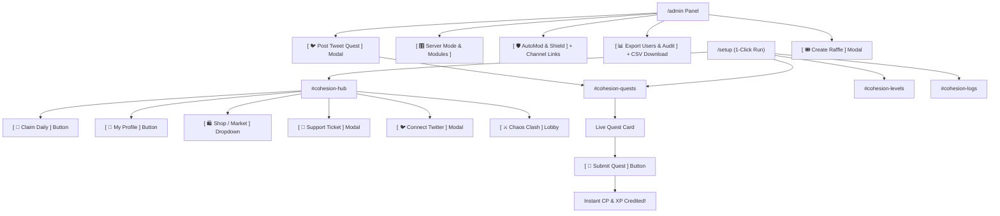

# ⚡ Ohesion — 100% UI-Driven Discord & Telegram Guide
> The modern community engagement, gamification, and security engine operated entirely through **Discord Buttons, Modals, and Interactive Dashboards**.

Live Web Documentation: [https://questify-bot-7i0l.onrender.com/docs](https://questify-bot-7i0l.onrender.com/docs)

---

## 📑 Table of Contents
1. [The Zero-Command Philosophy](#-the-zero-command-philosophy)
2. [1-Click Setup & Automated Channels](#-1-click-setup--automated-channels)
3. [Member Experience (100% Visual Buttons)](#-member-experience-100-visual-buttons)
   - [#cohesion-hub Interactive Buttons](#cohesion-hub-interactive-buttons)
   - [Submitting Quests via Live Cards](#submitting-quests-via-live-cards)
   - [Opening Support Tickets](#opening-support-tickets)
   - [Raffles, Live Auctions & Item Shop](#raffles-live-auctions--item-shop)
   - [Chaos Clash Battle Arena & Spectator Wagers](#chaos-clash-battle-arena--spectator-wagers)
4. [Administrator Experience (Visual Control Center)](#-administrator-experience-visual-control-center)
   - [Managing Server Modes & Module Checkboxes](#managing-server-modes--module-checkboxes)
   - [Cohesion Shield: Anti-Link & Channel Whitelisting](#cohesion-shield-anti-link--channel-whitelisting)
   - [Member Intelligence: Full CSV Export & Lifetime Audit](#member-intelligence-full-csv-export--lifetime-audit)
   - [Dropping Quests, Raffles & Marketplace Items](#dropping-quests-raffles--marketplace-items)
5. [Telegram Cross-Platform Bridge](#-telegram-cross-platform-bridge)
6. [Visual Interaction Flow Map](#-visual-interaction-flow-map)

---

## ✨ The Zero-Command Philosophy

Unlike traditional bots that force members to memorize dozens of complicated slash commands with multiple required options, **Ohesion is 100% UI-driven**:

* **Members never type slash commands:** They simply click interactive buttons in `#cohesion-hub` and on live cards to check their profile, claim daily points, enter raffles, buy roles, submit quests, or open support tickets.
* **Admins manage with visual tools:** Every administrative feature—turning modules on/off, whitelisting links per channel, and downloading CSV files—is controlled via visual buttons and native Discord pop-up modals.

---

## 🚀 1-Click Setup & Automated Channels

An administrator runs `/setup` just once. The bot automatically creates a complete, organized ecosystem in your server:

### 📁 COHESION HQ (Category Automatically Created)
* **`#cohesion-hub`** — The permanent interactive Member Control Center with all action buttons.
* **`#cohesion-quests`** — Visual cards for social raids, Twitter quests, and website visit campaigns.
* **`#cohesion-levels`** — Dedicated level-up announcements channel (keeps `#general` chat clean!).
* **`#cohesion-logs`** — Private administrative audit trail for staff.

---

## 🧭 Member Experience (100% Visual Buttons)

### `#cohesion-hub` Interactive Buttons
In `#cohesion-hub`, members have an always-active dashboard with direct buttons:

| Button | What Opens / Happens |
| :--- | :--- |
| **`[ 🎁 Claim Daily ]`** | Instantly awards daily points with consecutive day streak bonus multipliers. |
| **`[ 👤 My Profile ]`** | Opens an ephemeral private card showing Level, XP progress bar, Points (CP), linked Twitter, and wallet. |
| **`[ 🏆 Leaderboard ]`** | Shows the top 10 community leaderboard ranked by Points, XP, and Quests completed. |
| **`[ 🛍️ Shop / Market ]`** | Opens an interactive dropdown menu to purchase Discord roles and server perks with points. |
| **`[ 🎫 Support Ticket ]`** | Pops up a Discord Modal form (Subject & Description) and instantly opens a private 1-on-1 channel with staff. |
| **`[ 🐦 Connect Twitter ]`** | Pops up a modal asking for the member's Twitter handle to enable 1-click quest verification. |
| **`[ ⚔️ Chaos Clash ]`** | Opens the live battle arena lobby to join the match or wager points on fighting champions. |

---

### Submitting Quests via Live Cards
When an admin drops a quest into `#cohesion-quests`, it appears as an interactive visual embed:
1. Member clicks the tweet link directly from the card.
2. Member completes the action (Like, Retweet, or Comment) on Twitter.
3. Member clicks the green **`[ 🚀 Submit Quest ]`** button directly on the card.
4. Points and XP are credited to their balance instantly!

---

### Opening Support Tickets
1. Member clicks **`[ 🎫 Support Ticket ]`** in `#cohesion-hub`.
2. A native Discord Modal asks for Subject and Issue Description.
3. The bot creates a private channel (e.g. `#ticket-sukanto-1042`) visible only to the member and staff.
4. Inside the ticket channel, staff have interactive buttons:
   - **`[ 🔒 Close Ticket ]`**: Archives the ticket and revokes member typing permissions.
   - **`[ 📄 Save Transcript ]`**: Generates a downloadable text transcript of all messages and attachments.
   - **`[ 🗑️ Delete Channel ]`**: Safely deletes the channel.

---

### Raffles, Live Auctions & Item Shop
* **Raffles:** Live giveaway cards in `#cohesion-quests` with quick-buy buttons (`[ 🎟️ Buy 1x ]`, `[ 🎟️ Buy 5x ]`, `[ 🎟️ Buy 10x ]`, `[ 🎟️ Custom ]`). Automated winner drawing with roster export.
* **Live Auctions:** Real-time bidding card with `[ 🔨 Place Bid ]`. Automatically escrows points and refunds outbid members instantly.
* **Item Shop:** Members open `#cohesion-hub` and select roles from the dropdown menu to purchase with points.

---

### Chaos Clash Battle Arena & Spectator Wagers
* Click **`[ ⚔️ Chaos Clash ]`** in `#cohesion-hub` to view or start matches.
* Spectators click **`[ 🪙 Place Wager ]`** to bet points on participating fighters.
* When a fighter claims victory, the pot is split proportionally among winning bettors!

---

## ⚙️ Administrator Experience (Visual Control Center)

Admins run `/admin` (or click **`[ ⚙️ Feature Controls ]`** in `#cohesion-hub`) to access the complete administrative control center:

```
[ 🎛️ Server Mode & Modules ]  [ 🛡️ AutoMod & Shield ]     [ 📊 Export Users & Audit ]
[ 📢 Level-Up Channel ]        [ 🐦 Post Tweet Quest ]      [ 🎟️ Create Raffle ]
[ 🔨 Create Auction ]          [ 🛍️ Marketplace Manager ]   [ 🎙️ Voice Snapshot ]
```

---

### Managing Server Modes & Module Checkboxes
In `/admin` ➔ **`Server Mode & Modules`**, admins can toggle operating modes in seconds:

* **`🟢 Full Economy`**: Points (CP) + XP enabled.
* **`⚪ Level & XP Only`**: Points disabled, Server XP used as currency.
* **`🟣 Social & Roles Only`**: Points & Level-up messages completely disabled! Focuses on Quests, Raids & Support Tickets.
* **`🎛️ Custom Modular Mode`**: Click **`[ ⚙️ Select Active Modules ]`** and check/uncheck any of the 11 modules (Points, XP, Raffles, Auctions, Shop, Quests, Referrals, Attendance, Trivia, Battle, Tickets).

---

### Cohesion Shield: Anti-Link & Channel Whitelisting
Click **`[ 🛡️ AutoMod & Shield ]`** in the admin panel:
* **Toggles:** Toggle Anti-Link, Anti-Invite, and Rapid Message Flood Spam.
* **Banned Keywords:** Click `[ 📝 Banned Words ]` to input custom scam phrases via a modal form.
* **Punishment Policies:** Choose `⚠️ Warn Only`, `⏱️ Warn + Timeout (10m)`, or `🔨 Full Escalation (Warn ➔ 10m Timeout ➔ Auto-Ban)`.
* **Per-Channel Custom Link Whitelist:** Click `[ 🔗 Custom Channel Links ]`:
  1. Pick any channel from the Discord Channel dropdown.
  2. Click `[ 🛡️ Set Allowed Links ]` and type allowed domains (e.g. `x.com, twitter.com, rialo.io`).
  3. Approved links pass without warning; all other links are auto-deleted!
  4. Or click `[ 🟢 Allow All ]` (for media channels) or `[ 🔴 Block All ]` (for strict general chat).

---

### Member Intelligence: Full CSV Export & Lifetime Audit
Click **`[ 📊 Export Users & Audit ]`** in the admin panel:
* **Full Server CSV Export:** Click `[ 📥 Full Server Export (CSV) ]` with optional Start Date and End Date filters. Exports all members with IDs, usernames, message counts, levels, XP, points, wallet, twitter, and join dates.
* **Sync Message History:** 1-click button that scans all channels to the very beginning (50,000+ messages) to backfill 100% accurate lifetime counts matching Discord search!
* **Single Member Dossier:** Select any member from a search to inspect their top active channels, lifetime messages, and download their personal CSV report.

---

## ✈️ Telegram Cross-Platform Bridge

Connect your Discord server to an official Telegram group in 3 easy steps:
1. Add **`@OhesionBot`** to your Telegram group as an administrator.
2. In your Telegram group, send `/link`. The bot generates a 6-digit handshake code.
3. In Discord, run `/pair <code>`. Both platforms are now bridged and cross-synced!

---

## 🗺️ Visual Interaction Flow Map


