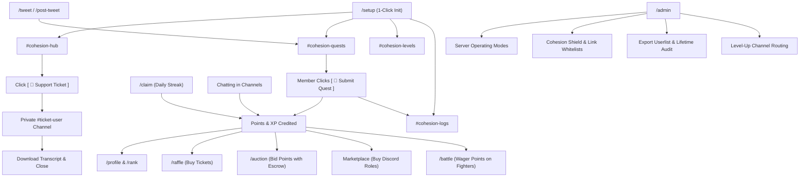

# Ohesion / Cohesion Bot — Official Documentation
> The enterprise-grade, all-in-one Discord & Telegram gamification, social engagement, and community security engine for Web3, creators, and gaming communities.

Visit the live interactive documentation portal: [https://questify-bot-7i0l.onrender.com/docs](https://questify-bot-7i0l.onrender.com/docs)

---

## 📑 Table of Contents
1. [Overview & Key Features](#-overview--key-features)
2. [1-Click Quick Setup (/setup)](#-1-click-quick-setup-setup)
3. [4 Server Operating Modes](#-4-server-operating-modes)
4. [Master Command Map (How Features Connect)](#-master-command-map-how-features-connect)
5. [Administrator Guide](#-administrator-guide)
   - [Managing Server Modules & Toggles](#managing-server-modules--toggles)
   - [Cohesion Shield (AutoMod & Link Whitelisting)](#cohesion-shield-automod--link-whitelisting)
   - [Member Data Analytics & CSV Exports](#member-data-analytics--csv-exports)
   - [Publishing Quests & Raids](#publishing-quests--raids)
   - [Telegram Cross-Platform Bridge](#telegram-cross-platform-bridge)
6. [User / Member Guide](#-user--member-guide)
   - [Connecting Twitter / X Handle](#connecting-twitter--x-handle)
   - [Completing Quests & Earning Points](#completing-quests--earning-points)
   - [Claiming Daily Check-in Rewards](#claiming-daily-check-in-rewards)
   - [Leveling & Unlocking Tier Roles](#leveling--unlocking-tier-roles)
   - [Entering Raffles, Auctions & Item Shop](#entering-raffles-auctions--item-shop)
   - [Chaos Clash Battle Arena & Spectator Bets](#chaos-clash-battle-arena--spectator-bets)
   - [Opening Support Tickets](#opening-support-tickets)
7. [Complete Command Cheatsheet](#-complete-command-cheatsheet)

---

## ⚡ Overview & Key Features

Cohesion is built with a singular design principle: **100% Native Discord Components**. There are zero broken slash command parameter forms for regular members. Everything runs through interactive buttons, dropdown selection menus, and native modals.

* **Boost Social Activity:** Reward members for Twitter/X likes, retweets, comments, and website visits.
* **Cohesion Shield (AutoMod):** Real-time protection against links, invite raids, message flood spam, and banned keywords. Includes per-channel customized link whitelisting.
* **Dual Currency Engine:** Switch between Cohesion Points (CP), Server Chat XP, or pure Social Role rewards.
* **Cross-Platform Bridge:** Bridge community activities, leaderboards, and quests directly with Telegram via `@OhesionBot`.
* **Reward Hub:** Raffles, real-time live auctions with escrow, role marketplaces, and interactive battle arenas.
* **Native Support Tickets:** Private 1-on-1 channels with modals, staff controls, and automatic text transcripts.
* **Data Intelligence:** Complete server member exports in CSV format with date-range filters and lifetime message sync.

---

## 🚀 1-Click Quick Setup (/setup)

Running `/setup` configures your server in under 5 seconds with optimal categories, channels, and permissions.

```bash
/setup
```

### What `/setup` Does Automatically:
1. **Creates Category:** `📁 COHESION HQ`
2. **Creates Dedicated Channels:**
   - `#cohesion-hub`: Permanent interactive community portal with quick buttons.
   - `#cohesion-quests`: Dedicated channel for social raids and Twitter quests.
   - `#cohesion-levels`: Dedicated level-up announcements channel (prevents chat spam in `#general`).
   - `#cohesion-logs`: Secure private audit logging channel for staff.
3. **Posts Interactive Hub:** Spawns the master dashboard in `#cohesion-hub` with direct buttons for Quests, Profile, Shop, Tickets, Daily Claim, and Admin Controls.

---

## 🎛️ 4 Server Operating Modes

Every server has different needs. In `/admin` ➔ **Server Mode & Modules**, admins can select between 4 architectures:

| Mode | Currency | Level-Up Messages | Description |
| :--- | :--- | :--- | :--- |
| **🟢 Full Economy** | Points (CP) + XP | Enabled | Both Points & XP enabled. Best for active Web3 & gaming communities. |
| **⚪ Level & XP Only** | Server XP Only | Enabled | Points disabled. Server XP is used for Raffles, Auctions, and Shop. |
| **🟣 Social & Roles Only** | None (Zero Currency) | **Disabled** | No points, no leveling spam. Focuses on Quests, Raids, Tickets & Role rewards. |
| **🎛️ Custom Modular Mode** | Configurable | Admin Toggleable | Check or uncheck any of the 11 modules to create your custom setup. |

---

## 🗺️ Master Command Map (How Features Connect)

Here is how commands and features connect into complete end-to-end workflows:



---

## 🛡️ Administrator Guide

### Managing Server Modules & Toggles
- Run `/admin` or click **`[ ⚙️ Feature Controls ]`** in `#cohesion-hub`.
- Select **`Server Mode & Modules`** ➔ Click **`[ ⚙️ Select Active Modules ]`**.
- Check or uncheck any feature (Points Economy, Leveling & XP, Raffles, Auctions, Marketplace, Quests, Referrals, Attendance, Trivia, Battle Engine, Support Tickets).
- Changes take effect instantly without restarting the bot.

### Cohesion Shield (AutoMod & Link Whitelisting)
- Run `/admin` ➔ Click **`[ 🛡️ AutoMod & Shield ]`**.
- **Toggles:** Toggle Anti-Link, Anti-Invite, and Anti-Spam Flood.
- **Custom Banned Words:** Click `[ 📝 Banned Words ]` to input custom scam phrases.
- **Punishment Policies:** Choose between `⚠️ Warn Only`, `⏱️ Warn + Timeout`, or `🔨 Full Escalation (Warn ➔ 10m Timeout ➔ Auto-Ban)`.
- **Per-Channel Link Whitelist:** Click `[ 🔗 Custom Channel Links ]`:
  1. Select any channel from the dropdown (e.g. `#twitter-raids`).
  2. Click `[ 🛡️ Set Allowed Links ]` and type allowed domains (e.g. `x.com, twitter.com, rialo.io`).
  3. In that channel, approved links pass without warning; all other links are auto-deleted!
  4. Or click `[ 🟢 Allow All ]` for open media channels, or `[ 🔴 Block All ]` for strict text channels.

### Member Data Analytics & CSV Exports
- Run `/admin` ➔ Click **`[ 📊 Export Users & Audit ]`**.
- **Full Server Export:** Click `[ 📥 Full Server Export (CSV) ]` with optional Start Date and End Date filters. Exports all members with IDs, usernames, message counts, level, XP, points, wallet, twitter, and join dates.
- **Single Member Dossier:** Click `[ 👤 Single Member Dossier ]` to view any member's breakdown of top channels and export their personal CSV.
- **Channel Message Audit:** Click `[ 🔍 Channel Message Audit ]` to inspect messages in any channel and download a ranked CSV leaderboard.
- **Lifetime Message History Sync:** Click `[ 🔄 Sync Message History ]` to scan all historical channel messages and backfill accurate counts.

### Publishing Quests & Raids
```bash
/tweet tweet_url:https://x.com/username/status/123456789 points:50 expire_hours:24 tag:@Socials
```
- Creates an interactive quest card in `#cohesion-quests`.
- Members submit proof with one button click.

### Telegram Cross-Platform Bridge
1. Add `@OhesionBot` to your Telegram group as administrator.
2. In Telegram, type `/link` to receive a 6-digit handshake code.
3. In Discord, type `/pair <code>`.
4. The two communities are now bridged!

---

## 👤 User / Member Guide

### Connecting Twitter / X Handle
- Type `/connect-twitter handle:your_handle` or click the button in `#cohesion-hub`.
- Linking your handle allows the bot to instantly verify your likes, retweets, and comments.

### Completing Quests & Earning Points
1. Check `#cohesion-quests` for active quests.
2. Complete the required actions on Twitter, YouTube, or the linked website.
3. Click the green **`[ 🚀 Submit Quest ]`** button on the quest card.
4. Points and XP are credited to your balance instantly!

### Claiming Daily Check-in Rewards
- Type `/claim` or click **`[ 🎁 Claim Daily ]`** in `#cohesion-hub`.
- Build a consecutive daily streak for bonus point multipliers.

### Leveling & Unlocking Tier Roles
- Chat naturally in permitted channels to earn XP (15–25 XP per message with cooldown).
- When leveling up, an announcement appears in `#cohesion-levels` and rewarded tier roles are automatically granted to your profile.

### Entering Raffles, Auctions & Item Shop
- **Raffles (`/raffle`):** Click quick-buy buttons (1x, 5x, 10x, or Custom) to enter ticket pools.
- **Auctions (`/auction`):** Place live bids with points. If outbid, your points are refunded immediately.
- **Marketplace:** Open `#cohesion-hub` and click **`[ 🛍️ Shop / Market ]`** to purchase exclusive roles with points.

### Chaos Clash Battle Arena & Spectator Bets
- Type `/battle` to launch or join a battle match.
- Spectators can wager points on participating fighters using `[ 🪙 Place Wager ]`.
- Winners take the split pot when their fighter claims victory!

### Opening Support Tickets
1. Open `#cohesion-hub` and click **`[ 🎫 Support Ticket ]`**.
2. Fill in the Subject and Description in the pop-up modal.
3. Head over to the private `#ticket-username-1234` channel to chat directly with server staff.
4. When finished, staff can close the ticket and download a complete transcript.

---

## ⌨️ Complete Command Cheatsheet

| Command | Category | Permitted | Description |
| :--- | :--- | :--- | :--- |
| `/setup` | Admin | Administrator | 1-click initialization of categories, channels, and hub. |
| `/admin` | Admin | Manage Server | Master administration center for modules, AutoMod, and exports. |
| `/hub` | General | Everyone | Opens interactive community hub (Quests, Shop, Profile, Tickets). |
| `/tweet` | Quests | Manage Server | Publishes an interactive Twitter raid into `#cohesion-quests`. |
| `/post-tweet` | Quests | Manage Server | Opens advanced visual modal to draft multi-requirement quests. |
| `/visit` | Quests | Manage Server | Publishes a website visit campaign for partnerships. |
| `/pair` | Integration | Administrator | Pairs Discord server with official Telegram group `@OhesionBot`. |
| `/raffle` | Economy | Manage Server | Creates an interactive ticket giveaway pool with auto drawing. |
| `/auction` | Economy | Manage Server | Launches real-time points auction with automated escrow bidding. |
| `/battle` | Gaming | Everyone | Launches Chaos Clash Arena tournament with spectator wagering. |
| `/claim` | Economy | Everyone | Claims daily check-in points with streak bonus multiplier. |
| `/profile` | Economy | Everyone | Displays points, level, XP, linked wallet, and twitter handle. |
| `/rank` | Economy | Everyone | Displays visual rank card with tier progression bar. |
| `/leaderboard`| Economy | Everyone | Displays top 10 members by Points, XP, or Quests. |
| `/connect-twitter`| Social | Everyone | Links Twitter / X username for automated quest verification. |
| `/ping` | System | Everyone | Checks bot latency and database connection status. |
| `/help` | System | Everyone | Displays quick navigation help menu. |
