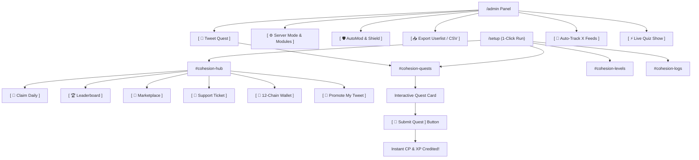

# ⚡ Ohesion — Complete 37-Button UI & Feature Manual
> The enterprise community engagement, gamification, and security engine operated **100% through Discord Buttons, Selection Menus, and Pop-up Modals**.

Live Interactive Documentation: [https://questify-bot-7i0l.onrender.com/docs](https://questify-bot-7i0l.onrender.com/docs)

---

## 📑 Table of Contents
1. [Visual System Overview](#-visual-system-overview)
2. [1-Click Setup & Automated Channels](#-1-click-setup--automated-channels)
3. [Member Hub: 12 Interactive Buttons](#-member-hub-12-interactive-buttons)
   - [Row 1: Daily Claim, Leaderboard, Raffles, Marketplace, Auctions](#row-1-daily-claim-leaderboard-raffles-marketplace-auctions)
   - [Row 2: 12-Chain Wallet, Change X, Connect Socials, Refresh](#row-2-12-chain-wallet-change-x-connect-socials-refresh)
   - [Row 3: Invite Codes & Referrals, Promote My Tweet (Raid), Support Ticket](#row-3-invite-codes--referrals-promote-my-tweet-raid-support-ticket)
4. [Admin Control Center: 25 Visual Buttons](#-admin-control-center-25-visual-buttons)
   - [Row 1: Quests, Raffles & Auctions](#row-1-quests-raffles--auctions)
   - [Row 2: Voice Snapshot, Member Rewards, Shop & Winner Draw](#row-2-voice-snapshot-member-rewards-shop--winner-draw)
   - [Row 3: Auto-Track X Feeds, Announcement Reacts, Milestone Roles & Inflation](#row-3-auto-track-x-feeds-announcement-reacts-milestone-roles--inflation)
   - [Row 4: Season Reset](#row-4-season-reset)
   - [Row 5: Quizzes, Trivia, Polls, Chaos Clash & Voice Studio](#row-5-quizzes-trivia-polls-chaos-clash--voice-studio)
   - [Row 6: Server Modes, Telegram Settings, Level-Up Channel & CSV Exports](#row-6-server-modes-telegram-settings-level-up-channel--csv-exports)
   - [Row 7: Cohesion Shield & Per-Channel Link Rules](#row-7-cohesion-shield--per-channel-link-rules)
5. [End-to-End Visual Workflow Map](#-end-to-end-visual-workflow-map)

---

## ⚡ Visual System Overview

Neither members nor administrators need to type slash commands or memorize complex parameters:
* **Member Hub (`#cohesion-hub`):** 12 interactive buttons organized across 3 action rows.
* **Admin Dashboard (`/admin`):** 25 visual management buttons organized across 7 functional rows.

---

## 🚀 1-Click Setup & Automated Channels

An administrator runs `/setup` just once. Ohesion automatically configures:
* **`📁 COHESION HQ`** — Organized category with tailored permissions.
* **`#cohesion-hub`** — Deploys the interactive 12-button Member Dashboard.
* **`#cohesion-quests`** — Dedicated channel for social raids and Twitter quests.
* **`#cohesion-levels`** — Dedicated level-up announcements channel (stops general chat spam!).
* **`#cohesion-logs`** — Private administrative audit trail for staff.

---

## 🧭 Member Hub: 12 Interactive Buttons

### Row 1: Daily Claim, Leaderboard, Raffles, Marketplace, Auctions
```
[ 🎁 Claim Daily ]  [ 🏆 Leaderboard ]  [ 🎟️ Raffles ]  [ 🛒 Marketplace ]  [ 🔨 Auctions ]
```
1. **`🎁 Claim Daily`**: 1-click daily points claim. Awards consecutive day streak bonus multipliers to boost balance.
2. **`🏆 Leaderboard`**: Ephemeral popup displaying the top 10 community members ranked by Points (CP), XP, or Quests.
3. **`🎟️ Raffles`**: Opens the active raffles menu. Members buy tickets (1x, 5x, 10x, Custom) with points to win prizes.
4. **`🛒 Marketplace`**: Interactive dropdown menu to purchase Discord roles and server perks with points.
5. **`🔨 Auctions`**: Real-time live auctions. Members bid points with instant escrow and automatic refunds if outbid.

---

### Row 2: 12-Chain Wallet, Change X, Connect Socials, Refresh
```
[ 👛 12-Chain Wallet ]  [ 🐦 Change X ]  [ 🌐 Connect Socials ]  [ 🔄 Refresh ]
```
6. **`👛 12-Chain Wallet`**: Modal form to link an EVM (Ethereum, BSC, Base, Arbitrum) or Solana payout address for prize distributions.
7. **`🐦 Change X`**: Modal form to link or update Twitter / X handle. Enables instant 1-click verification on tweet quests.
8. **`🌐 Connect Socials`**: Connect YouTube, TikTok, and CoinMarketCap accounts for cross-platform quests.
9. **`🔄 Refresh`**: Instantly recalculates and updates personal XP, Level progress bar, and Point balance on the card.

---

### Row 3: Invite Codes & Referrals, Promote My Tweet (Raid), Support Ticket
```
[ 👥 Invite Codes & Referrals ]  [ 🚀 Promote My Tweet (Raid) ]  [ 🎫 Support Ticket ]
```
10. **`👥 Invite Codes & Referrals`**: Generates a personal invite code. Shows how many members joined with your code and your earned bonus points.
11. **`🚀 Promote My Tweet (Raid)`**: Community-funded tweet raids! Members spend their earned points to launch a raid on their own tweet.
12. **`🎫 Support Ticket`**: Opens a modal for Subject and Description, then creates a private `#ticket-user` channel. Staff role is auto-tagged (if configured). When closed, staff can click **`[ 🔓 Reopen Ticket (Staff Only) ]`** which restores channel messaging and pings the ticket creator!

---

## ⚙️ Admin Control Center: 25 Visual Buttons

Admins run `/admin` (or click **`[ ⚙️ Feature Controls ]`** in `#cohesion-hub`) to access the complete administrative control center:

### Row 1: Quests, Raffles & Auctions
```
[ 📢 Tweet Quest ]  [ 🌐 CMC & Video Quests ]  [ 📝 Quest Drafts ]  [ 🎟️ Create Raffle ]  [ 🔨 Create Auction ]
```
1. **`📢 Tweet Quest`**: Visual modal: Tweet URL, Points reward, Expiration hours, Tag requirement, and Call to action.
2. **`🌐 CMC & Video Quests`**: Modal form to drop YouTube video, TikTok, or CoinMarketCap gravity quests into `#cohesion-quests`.
3. **`📝 Quest Drafts`**: View, edit, or launch previously drafted quests without retyping URLs.
4. **`🎟️ Create Raffle`**: Interactive form: Prize title, Ticket price (CP/XP), Max tickets per user, Duration, and Winner count.
5. **`🔨 Create Auction`**: Interactive form: Auction item, Starting bid, Min bid increment, Duration, and Description.

---

### Row 2: Voice Snapshot, Member Rewards, Shop & Winner Draw
```
[ 🎙️ VC Snapshot ]  [ 🎁 Reward Member / Role ]  [ 🛒 Add Shop Item ]  [ 📜 Shop Orders ]  [ 🎲 Draw Winner ]
```
6. **`🎙️ VC Snapshot`**: 1-click attendance taker. Scans all active voice channels and awards points & XP to all connected listeners.
7. **`🎁 Reward Member / Role`**: Manually credit or deduct Points / XP from an individual user or all members holding a specific Discord role.
8. **`🛒 Add Shop Item`**: Modal form: Item name, Point price, Stock limit, and auto-granted Discord Role upon purchase.
9. **`📜 Shop Orders`**: Displays order log of all marketplace purchases and auto-role delivery statuses.
10. **`🎲 Draw Winner`**: Instantly concludes an active raffle, selects random winning ticket(s), and exports a CSV roster to staff.

---

### Row 3: Auto-Track X Feeds, Announcement Reacts, Milestone Roles & Inflation
```
[ 🤖 Auto-Track X Feeds ]  [ ⚡ Announcement Reacts ]  [ 🎖️ 5-Tier Milestone Roles ]  [ 🔥 Weekly Inflation / Decay ]
```
11. **`🤖 Auto-Track X Feeds`**: Monitors official Twitter accounts. When a new tweet is posted, bot automatically drops a raid quest!
12. **`⚡ Announcement Reacts`**: Configure channels where reacting to announcements awards bonus points (e.g. 10 CP per reaction).
13. **`🎖️ 5-Tier Milestone Roles`**: Assign automatic Discord roles when members reach Level 5 (Bronze), 10 (Silver), 20 (Gold), 30 (Diamond).
14. **`🔥 Weekly Inflation / Decay`**: Applies a weekly percentage burn (e.g. 5% or flat 50 CP) to inactive balances to prevent point hoarding.

---

### Row 4: Season Reset
```
[ 🔄 Season Reset ]
```
15. **`🔄 Season Reset`**: Conclude a competitive season. Archives final leaderboards, wipes current point balances, and starts a fresh competitive cycle while preserving user levels and historical message archives.

---

### Row 5: Quizzes, Trivia, Polls, Chaos Clash & Voice Studio
```
[ 🧠 Create Quiz ]  [ ⚡ Live Quiz Show ]  [ 📊 Create Poll ]  [ ⚔️ Chaos Clash ]  [ 🎙️ Voice Studio Notes ]
```
16. **`🧠 Create Quiz`**: Launch a solo interactive quiz challenge where members answer questions for rewards.
17. **`⚡ Live Quiz Show`**: Starts a Kahoot-style real-time community trivia showdown with live scoreboards.
18. **`📊 Create Poll`**: Modal form to launch community polls with interactive button choices and live visual percentage bars.
19. **`⚔️ Chaos Clash`**: Launches a battle tournament lobby where members join as fighters and spectators wager points on winners.
20. **`🎙️ Voice Studio Notes`**: Generate audio recordings and AI summary notes from community calls, AMAs, and voice events.

---

### Row 6: Server Modes, Telegram Settings, Level-Up Channel & CSV Exports
```
[ ⚙️ Server Mode & Modules ]  [ ✈️ Telegram Settings ]  [ 📢 Level-Up Channel ]  [ 📥 Export Userlist / CSV ]
```
21. **`⚙️ Server Mode & Modules`**: Select from 4 Presets, toggle any of the 11 modules via checkboxes, or click **`[ 🎫 Ticket Auto-Tag ]`** to configure which staff role gets auto-tagged when a new ticket is opened (or disable it completely)!
22. **`✈️ Telegram Settings`**: Configure and manage the Telegram group bridge with `@OhesionBot`.
23. **`📢 Level-Up Channel`**: Choose where level-up messages are routed (e.g. `#cohesion-levels`) or select **⛔ Disabled** to silence chat announcements!
24. **`📥 Export Userlist / CSV`**: Opens the Unified Export Dashboard: Full Server CSV with Date-Range filters, Single Member Dossiers, and **Sync Message History** (50,000+ messages)!

---

### Row 7: Cohesion Shield & Per-Channel Link Rules
```
[ 🛡️ AutoMod & Shield ]
```
25. **`🛡️ AutoMod & Shield`**: Opens the master security deck:
    * **Toggles:** Anti-Link, Anti-Invite, and Rapid Message Flood Spam.
    * **Banned Keywords:** Modal form to input scam phrases and rival project names.
    * **Punishment Escalation:** Choose Warn Only, Warn + Timeout (10m), or 3-Strike Auto-Ban.
    * **`[ 🔗 Custom Channel Links ]`**: Dropdown menu to pick any channel and set its custom link rule:
      - **`[ 🛡️ Set Allowed Links ]`**: Modal where you enter approved domains (e.g. `x.com, twitter.com, rialo.io`). Only approved links pass; all others get deleted!
      - **`[ 🟢 Allow All ]`**: Unrestricted links allowed (e.g. media channels).
      - **`[ 🔴 Block All ]`**: Strictly zero links allowed (e.g. general chat).
      - **`[ 🗑️ Reset to Default ]`**: Reverts channel to server default policy.

---

## 🗺️ End-to-End Visual Workflow Map


